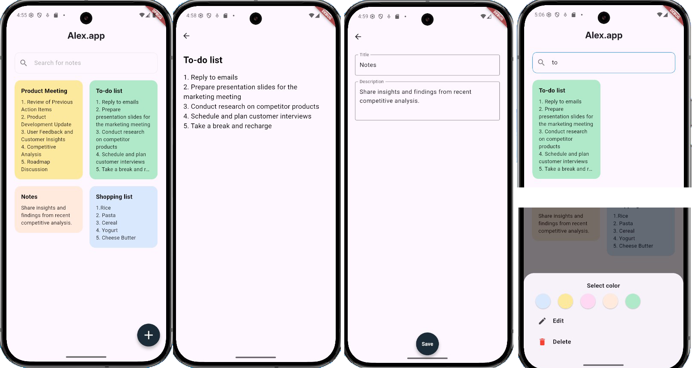

# flutter_simple_note

A new Flutter simple note.

## Description of the task

Building a simple note app using Flutter, Hive flutter, and flutter bloc

## Implementation details

Create an application in which the user can add and delete his notes, change the color of nonatok cards on the main screen. Edit Notes. Search the list of notes. Notes are stored in the permanent memory of the user's phone.

## How Application looks like

## Technologies used in the project

- Flutter, 
- Hive_flutter, 
- flutter_bloc

## Getting Started

This project is a starting point for a Flutter application.

A few resources to get you started if this is your first Flutter project:

- [Lab: Write your first Flutter app](https://docs.flutter.dev/get-started/codelab)
- [Cookbook: Useful Flutter samples](https://docs.flutter.dev/cookbook)

For help getting started with Flutter development, view the
[online documentation](https://docs.flutter.dev/), which offers tutorials,
samples, guidance on mobile development, and a full API reference.
